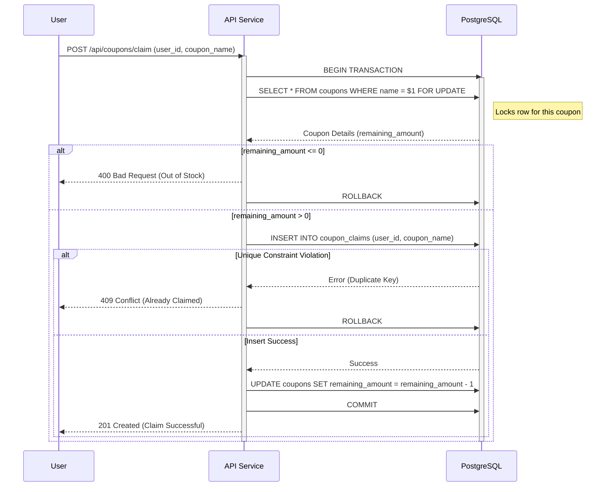
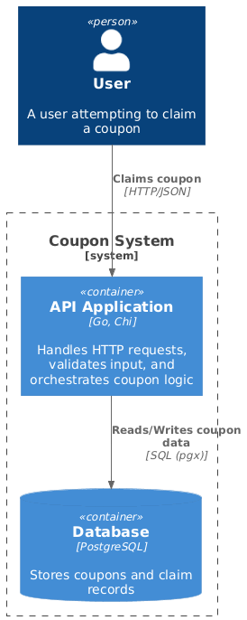

# Coupon System

## Prerequisites

- **Docker Desktop**: Required to run the application containers and database.
- **Go 1.25+**: (Optional) If you want to run tests locally without Docker.
- **Make**: For running Makefile commands.

## How to Run
### Automatic
This command will setup:
- .env
- Start all applications in docker-compose
- Run migrations

```bash
make setup
```

### Manual Step by Step

1.  **Start the Application**:
    ```bash
    make start
    ```
    This command uses `docker-compose` to build and start the application service and the PostgreSQL database.

2.  **Run Migrations**:
    ```bash
    make migrate-up
    ```

3.  **Stop the Application**:
    ```bash
    make stop
    ```

## How to Test

### Load Tests (k6)

To run the load tests simulating concurrent coupon claims:

1.  **Run All Load Tests**:
    ```bash
    make tests-load-all
    ```
    This runs both the "Race Condition" (multiple users, limited stock) and "Same User" (single user, multiple claims) scenarios.

### Unit Tests

Not every file is tested yet, but you can run the unit tests:

```bash
make tests-unit
```

### Manual API Testing

You can trigger the endpoints using `curl` or Postman.

**Create a Coupon:**
```bash
curl -X POST http://localhost:8080/api/coupons \
  -H "Content-Type: application/json" \
  -d '{"name": "PROMO2024", "amount": 100}'
```

**Claim a Coupon:**
```bash
curl -X POST http://localhost:8080/api/coupons/claim \
  -H "Content-Type: application/json" \
  -d '{"coupon_name": "PROMO2024", "user_id": "user123"}'
```

**Get Coupon Details:**
```bash
curl http://localhost:8080/api/coupons/PROMO2024
```

## Architecture Notes

### Database Design & Locking Strategy

The system uses **PostgreSQL** as the data store. Two main tables are used:
- `coupons`: Stores coupon details (`name`, `amount`, `remaining_amount`).
- `coupon_claims`: Stores claim records (`coupon_name`, `user_id`).

**Concurrency Control:**
To prevent race conditions (over-claiming tickets) and ensure data integrity:
1.  **Pessimistic Locking (`SELECT ... FOR UPDATE`)**: When a user attempts to claim a coupon, we lock the specific coupon row in the `coupons` table. This prevents other transactions from modifying the stock simultaneously.
2.  **Unique Index**: A unique composite index on `(coupon_name, user_id)` in the `coupon_claims` table ensures that a single user cannot claim the same coupon more than once, enforcing the business rule at the database level.

### Sequence Diagram (Coupon Claim Flow)



### C4 Diagram




## Environment Variables Defined
```
LOG_LEVEL=debug

DB_DSN=postgres://postgres@postgres:5432/coupon_system_development?sslmode=disable
DB_MAX_OPEN_CONNECTIONS=3
DB_MAX_IDLE_CONNECTIONS=1
DB_MAX_CONNECTIONS_LIFETIME=3h
DB_MAX_CONNECTION_IDLE_TIME=10m
HTTP_PORT=8080
HTTP_TIMEOUT=30s
```

## Log Level
- `info` : showing log with json format
- `debug` : showing log with json format, function name and line number and stack trace if error